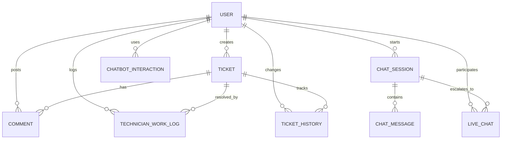

# UniHelp IT Helpdesk - Database Schema Documentation

## Database Type: SQLite
- **File:** `unihelp.db`
- **Purpose:** Complete IT helpdesk management system with role-based access control

---

## 📊 Entity Relationship Diagram (ERD)



---

## 🗄️ Table Structures

### **1. User Table**
Authentication and role management

| Column | Type | Description |
|--------|------|-------------|
| `userid` | INTEGER (PK) | Auto-increment user ID |
| `name` | VARCHAR(100) | User's full name |
| `email` | VARCHAR(100) | Unique email (login username) |
| `passwordhash` | VARCHAR(255) | bcrypt hashed password |
| `role` | VARCHAR(20) | admin/staff/technician/student |
| `isapproved` | BOOLEAN | Admin approval status |
| `created_at` | TIMESTAMP | Registration date |

**Sample Data:**
```sql
SELECT * FROM user LIMIT 3;
-- admin@unihelp.com (Admin), tech@unihelp.com (Technician), student@unihelp.com (Student)
```

---

### **2. Ticket Table**
Core support ticket tracking

| Column | Type | Description |
|--------|------|-------------|
| `ticketid` | INTEGER (PK) | Auto-increment ticket ID |
| `title` | VARCHAR(200) | Issue summary |
| `description` | TEXT | Detailed problem description |
| `category` | VARCHAR(50) | Hardware/Software/Network/etc |
| `priority` | VARCHAR(20) | Low/Medium/High/Urgent |
| `status` | VARCHAR(30) | Open/In Progress/Pending/Resolved/Closed/Reopened |
| `filepath` | VARCHAR(255) | Screenshot/attachment path |
| `createdat` | TIMESTAMP | Creation timestamp |
| `updatedat` | TIMESTAMP | Last update timestamp |
| `resolvedat` | TIMESTAMP | Resolution timestamp |
| `userid` | INTEGER (FK) | Creator (user who reported) |
| `assignedto` | INTEGER (FK) | Assigned technician |
| `resolvedby` | INTEGER (FK) | Technician who resolved |
| `time_spent_hours` | REAL | Time spent on resolution |
| `resolution_notes` | TEXT | Resolution description |
| `satisfaction_rating` | INTEGER | 1-5 star rating |

**Key Features:**
- Full lifecycle tracking (Open → In Progress → Resolved → Closed)
- SLA monitoring via timestamps
- Satisfaction surveys
- File attachments support

---

### **3. Comment Table**
Ticket discussion thread

| Column | Type | Description |
|--------|------|-------------|
| `commentid` | INTEGER (PK) | Auto-increment comment ID |
| `content` | TEXT | Comment text |
| `createdat` | TIMESTAMP | Comment timestamp |
| `ticketid` | INTEGER (FK) | Associated ticket |
| `userid` | INTEGER (FK) | Comment author |

---

### **4. Chat Session Table**
AI chatbot conversation tracking

| Column | Type | Description |
|--------|------|-------------|
| `sessionid` | INTEGER (PK) | Auto-increment session ID |
| `userid` | INTEGER (FK) | User who started chat |
| `status` | VARCHAR(20) | active/resolved/escalated |
| `created_at` | TIMESTAMP | Session start time |
| `resolved_at` | TIMESTAMP | Resolution time |
| `escalated_ticket_id` | INTEGER (FK) | Escalated ticket reference |

---

### **5. Chat Message Table**
Individual chat messages

| Column | Type | Description |
|--------|------|-------------|
| `messageid` | INTEGER (PK) | Auto-increment message ID |
| `sessionid` | INTEGER (FK) | Chat session reference |
| `sender` | VARCHAR(20) | user/ai/technician |
| `message` | TEXT | Message content |
| `intent` | VARCHAR(50) | AI-detected intent |
| `created_at` | TIMESTAMP | Message timestamp |

---

### **6. Live Chat Table**
Real-time technician-user chat

| Column | Type | Description |
|--------|------|-------------|
| `livechatid` | INTEGER (PK) | Auto-increment chat ID |
| `sessionid` | INTEGER (FK) | Chat session reference |
| `technicianid` | INTEGER (FK) | Assigned technician |
| `status` | VARCHAR(20) | active/closed |
| `started_at` | TIMESTAMP | Chat start time |
| `ended_at` | TIMESTAMP | Chat end time |

---

### **7. Technician Work Log Table**
Technician activity tracking

| Column | Type | Description |
|--------|------|-------------|
| `worklogid` | INTEGER (PK) | Auto-increment log ID |
| `technicianid` | INTEGER (FK) | Technician ID |
| `ticketid` | INTEGER (FK) | Related ticket (optional) |
| `work_type` | VARCHAR(50) | ticket_resolution/live_chat/maintenance/other |
| `start_time` | TIMESTAMP | Work start time |
| `end_time` | TIMESTAMP | Work end time |
| `hours_worked` | REAL | Total hours worked |
| `description` | TEXT | Work description |
| `created_at` | TIMESTAMP | Log creation time |

---

### **8. Ticket History Table**
Audit trail for ticket changes

| Column | Type | Description |
|--------|------|-------------|
| `historyid` | INTEGER (PK) | Auto-increment history ID |
| `ticketid` | INTEGER (FK) | Ticket reference |
| `changed_by` | INTEGER (FK) | User who made change |
| `old_status` | VARCHAR(30) | Previous status |
| `new_status` | VARCHAR(30) | New status |
| `old_assignedto` | INTEGER (FK) | Previous assignee |
| `new_assignedto` | INTEGER (FK) | New assignee |
| `change_reason` | TEXT | Reason for change |
| `changed_at` | TIMESTAMP | Change timestamp |

---

### **9. Monthly Reports Cache Table**
Pre-computed report data

| Column | Type | Description |
|--------|------|-------------|
| `reportid` | INTEGER (PK) | Auto-increment report ID |
| `report_month` | VARCHAR(7) | Format: YYYY-MM |
| `report_type` | VARCHAR(50) | tickets/users/chats/etc |
| `report_data` | TEXT | JSON-formatted data |
| `generated_at` | TIMESTAMP | Report generation time |

---

## 🔑 Key Relationships

### **User Roles & Permissions:**
- **Admin:** Full access to all features, users, reports
- **Technician:** Handle tickets, live chats, work logs
- **Staff/Student:** Create tickets, view own tickets, rate resolutions

### **Ticket Lifecycle:**
```
User Creates Ticket 
  → Admin Assigns to Technician 
  → Technician Updates Status 
  → Ticket Resolved 
  → User Rates Satisfaction
```

### **Chat Escalation Flow:**
```
AI Chatbot Session 
  → Unresolved Issue 
  → Escalate to Live Chat 
  → Technician Joins 
  → Create Ticket if Needed
```

---

## 📈 Sample Queries for Demonstration

### **1. Show Ticket Statistics:**
```sql
SELECT 
    status,
    COUNT(*) as count,
    AVG(JULIANDAY(resolvedat) - JULIANDAY(createdat)) as avg_resolution_days
FROM ticket
GROUP BY status;
```

### **2. Technician Performance:**
```sql
SELECT 
    u.name,
    COUNT(t.ticketid) as tickets_resolved,
    SUM(tl.hours_worked) as total_hours
FROM user u
LEFT JOIN ticket t ON u.userid = t.resolvedby
LEFT JOIN technician_work_log tl ON u.userid = tl.technicianid
WHERE u.role = 'technician'
GROUP BY u.userid;
```

### **3. Recent Activity:**
```sql
SELECT 
    t.title,
    u.name as creator,
    t.status,
    t.createdat
FROM ticket t
JOIN user u ON t.userid = u.userid
ORDER BY t.createdat DESC
LIMIT 10;
```

---

## 🎯 How to Present to Examiner

### **Step 1: Show Database File**
```bash
# Show the database file exists
ls unihelp.db
```

### **Step 2: Use DB Browser Tool**
Download **DB Browser for SQLite** (free tool):
1. Open `unihelp.db` in DB Browser
2. Show "Database Structure" tab
3. Browse data in each table
4. Execute sample queries

### **Step 3: Run Backend Script**
```bash
python check_db.py
```

### **Step 4: Show API Endpoints**
Run the Flask app and show:
- Route definitions in `app.py`
- Database connection handling
- CRUD operations

### **Step 5: Demonstrate Transactions**
Show how ticket creation works:
1. Insert into `ticket` table
2. Add to `ticket_history`
3. Send email notification
4. All in one transaction

---

## 💡 Key Selling Points for Examiner

✅ **Normalized Design:** Proper foreign keys and referential integrity  
✅ **Audit Trail:** Complete history tracking for compliance  
✅ **Security:** Password hashing, role-based access control  
✅ **Scalability:** Modular design ready for migration to PostgreSQL  
✅ **Analytics:** Pre-computed reports for performance  
✅ **Modern Stack:** SQLite + Flask + SQLAlchemy patterns  

---

## 🔧 Tools to Install for Demo

1. **DB Browser for SQLite:** https://sqlitebrowser.org/
2. **SQLite Command Line:**
   ```bash
   sqlite3 unihelp.db
   .tables
   .schema user
   SELECT * FROM user;
   ```

---

**Generated for Final Year Project Defense - UniHelp IT Helpdesk System**
